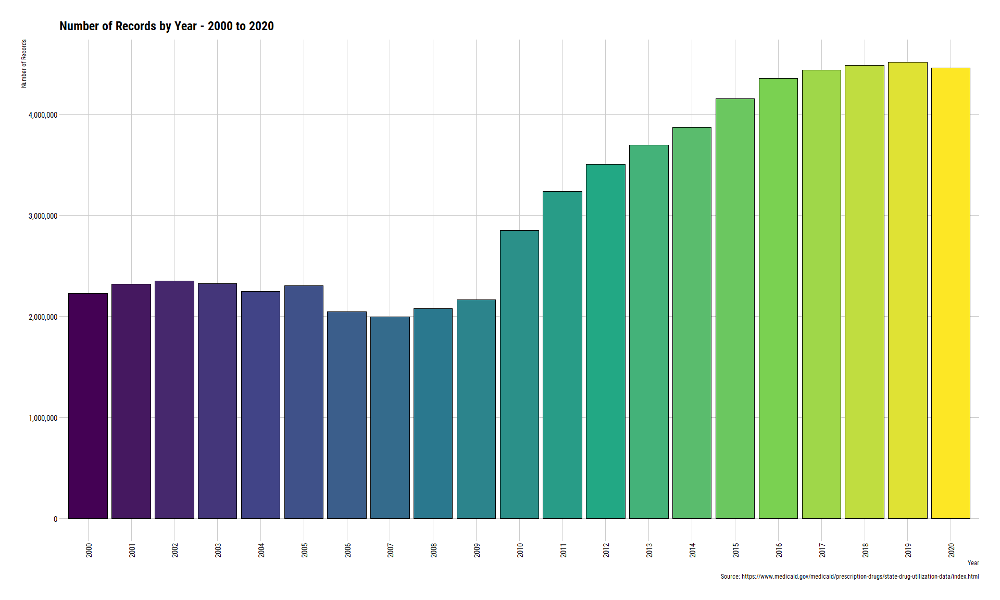
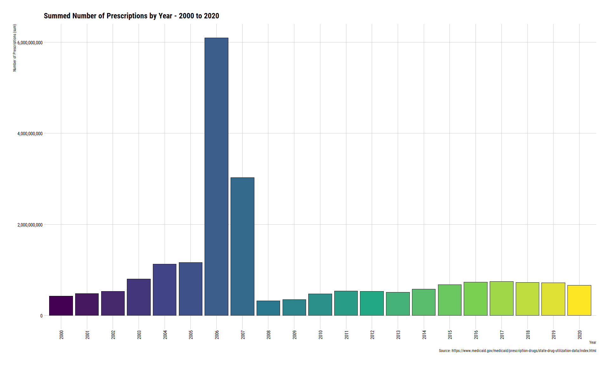
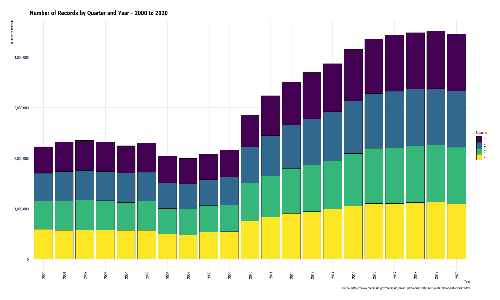
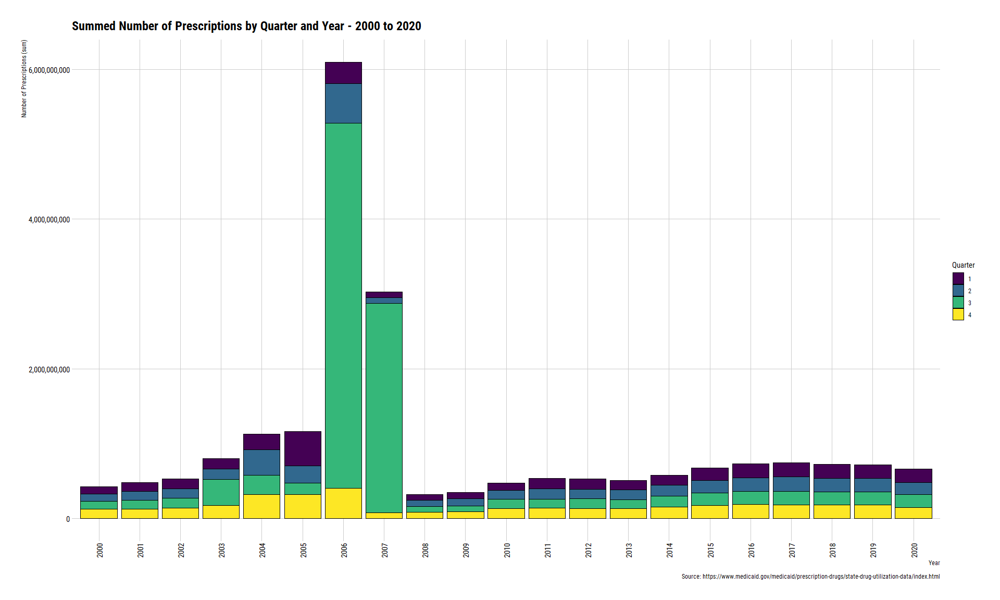
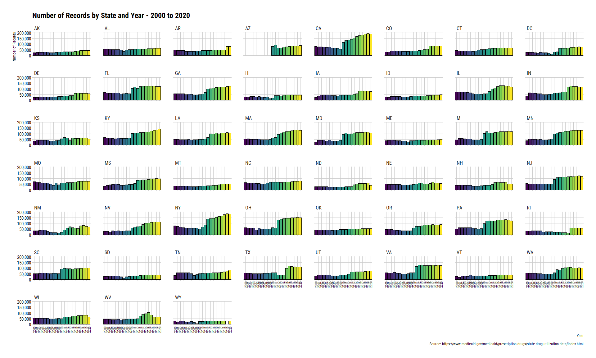
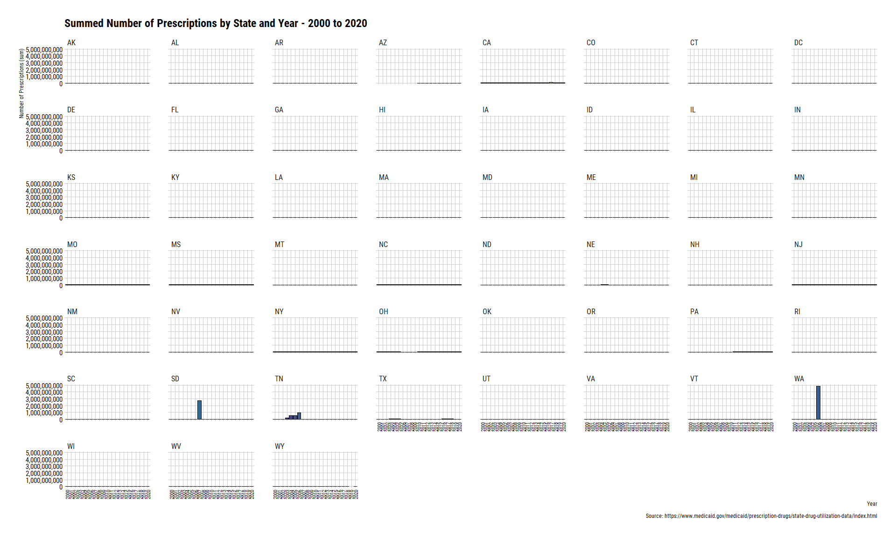
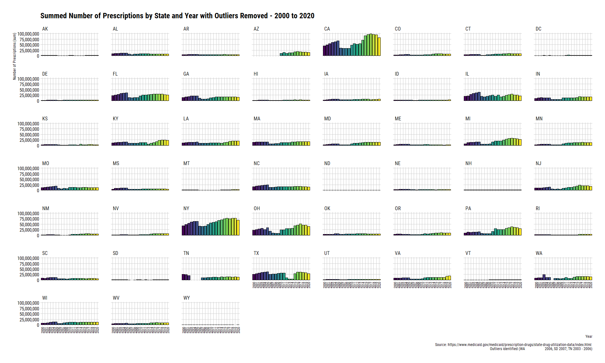
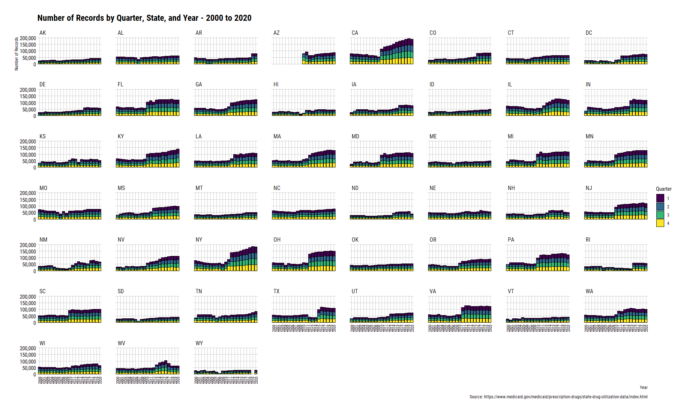
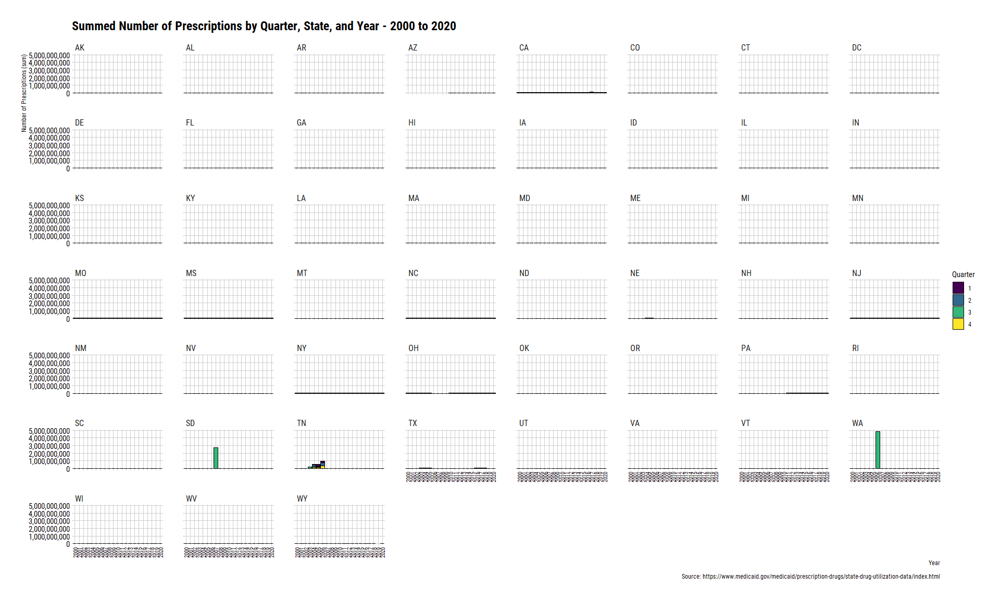
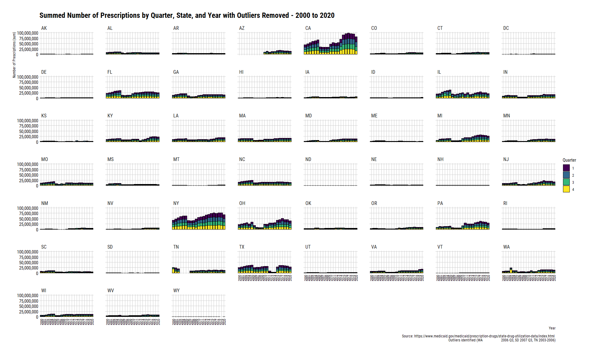

Medicaid State Drug Utilization, 2000 - 2020
================
Michael Quinn Maguire, MS [1]Amie Goodin, PhD, MPP [2]Juan
Hincapie-Castillo, PharmD, PhD, MS [3]

## Overview

The following document provides a glimpse into the compiled drug
utilization datasets from [Centers for Medicare & Medicaid
Services](https://www.medicaid.gov/medicaid/prescription-drugs/state-drug-utilization-data/index.html).

New data extracts are pulled whenever the script
02\_create-examine-date-metadata.R detects that there are differences
between the previously extracted metadata and the current metadata on
the website.

Data were compiled from the “full” datasets available in the dropdown
menu. Overall national totals denoted with a state field of “XX” were
removed after compiling the datasets into a single object.

Data were then matched to [IBM’s Micromedex Red
Book](https://www.ibm.com/products/micromedex-red-book) by the NDC code.

These plots show that there are some inconsistencies and data reporting
issues for certain years. Please be cognizant of these issues when
conducting your analyses or submitting your requests.

I produce more specialized plots when a request is made. If you think
there is another type of plot that would be useful for this report,
please contact me via email.

Please refer to the code in other areas of my [GitHub
Repository](https://github.com/michaelqmaguire/medicaid-drug-utilization)
for more specific information on how cleaning was performed. If you have
any questions, please feel free to contact me at
<michaelqmaguire2@cop.ufl.edu>.

Datasets are not publicly available due to size considerations. They can
be made available upon request and discussion with my supervisors.

Datasets were imported and cleaned using R software. This report was
written and compiled using RMarkdown. More information about RMarkdown
can be located [here](https://rmarkdown.rstudio.com/).

### Setup

#### Loading libraries used to plot information

``` r
library(data.table)
library(hrbrthemes)
library(tidyverse)
library(tidylog)
```

#### Reading in the final dataset

``` r
sdudFinal <-
  fread(
    "./data/clean/03_sdud-redbook-final.csv",
    colClasses = c("proper_ndc" = "character")
  )

sdudFinal
```

    ##            proper_ndc utilization.type year quarter state suppression numberrx
    ##        1: 00002010102             FFSU 2020       2    TN           T        0
    ##        2: 00002010102             FFSU 2020       3    TN           T        0
    ##        3: 00002010102             MCOU 2020       4    TN           F       41
    ##        4: 00002010102             MCOU 2020       3    TN           F       59
    ##        5: 00002010102             MCOU 2020       1    TN           F       24
    ##       ---                                                                     
    ## 65622560: 99207086508             FFSU 2003       4    NE           T        0
    ## 65622561: 99207086508             FFSU 2003       4    CA           T        0
    ## 65622562: 99207086508             FFSU 2003       3    CA           T        0
    ## 65622563: 99207086508             FFSU 2003       4    IL           T        0
    ## 65622564: 99207086508             FFSU 2003       4    WA           T        0
    ##           seqidall seqidndc deaclas generid maintin prodcat siglsrc genind
    ##        1:  1240839    42188       7  999999       3       8       N      6
    ##        2:  2876968    42188       7  999999       3       8       N      6
    ##        3:  3408684    42188       7  999999       3       8       N      6
    ##        4:  3740945    42188       7  999999       3       8       N      6
    ##        5:  3805218    42188       7  999999       3       8       N      6
    ##       ---                                                                 
    ## 65622560: 57391510    91939       7  117166       4       7       N      6
    ## 65622561: 58035571    91939       7  117166       4       7       N      6
    ## 65622562: 58050004    91939       7  117166       4       7       N      6
    ## 65622563: 58450139    91939       7  117166       4       7       N      6
    ## 65622564: 58528983    91939       7  117166       4       7       N      6
    ##           desidrg mastfrm pkqtycd thercls thergrp pksize    therdtl
    ##        1:       N     ECT      EA     101      13    100 4004010030
    ##        2:       N     ECT      EA     101      13    100 4004010030
    ##        3:       N     ECT      EA     101      13    100 4004010030
    ##        4:       N     ECT      EA     101      13    100 4004010030
    ##        5:       N     ECT      EA     101      13    100 4004010030
    ##       ---                                                          
    ## 65622560:       N     SHA      EA     201      26      1 8432010030
    ## 65622561:       N     SHA      EA     201      26      1 8432010030
    ## 65622562:       N     SHA      EA     201      26      1 8432010030
    ## 65622563:       N     SHA      EA     201      26      1 8432010030
    ## 65622564:       N     SHA      EA     201      26      1 8432010030
    ##                          gnindds        metsize         maintds strngth
    ##        1: Over the counter (OTC)       EA 00100 Primarily acute  7.5 GR
    ##        2: Over the counter (OTC)       EA 00100 Primarily acute  7.5 GR
    ##        3: Over the counter (OTC)       EA 00100 Primarily acute  7.5 GR
    ##        4: Over the counter (OTC)       EA 00100 Primarily acute  7.5 GR
    ##        5: Over the counter (OTC)       EA 00100 Primarily acute  7.5 GR
    ##       ---                                                              
    ## 65622560: Over the counter (OTC) 000236.0000 ML  ~Missing/Other      5%
    ## 65622561: Over the counter (OTC) 000236.0000 ML  ~Missing/Other      5%
    ## 65622562: Over the counter (OTC) 000236.0000 ML  ~Missing/Other      5%
    ## 65622563: Over the counter (OTC) 000236.0000 ML  ~Missing/Other      5%
    ## 65622564: Over the counter (OTC) 000236.0000 ML  ~Missing/Other      5%
    ##               prdctds                   thrdtds                mstfmds
    ##        1: OTC/Generic Ammonium Chloride & Comb. Tablet, Enteric Coated
    ##        2: OTC/Generic Ammonium Chloride & Comb. Tablet, Enteric Coated
    ##        3: OTC/Generic Ammonium Chloride & Comb. Tablet, Enteric Coated
    ##        4: OTC/Generic Ammonium Chloride & Comb. Tablet, Enteric Coated
    ##        5: OTC/Generic Ammonium Chloride & Comb. Tablet, Enteric Coated
    ##       ---                                                             
    ## 65622560:   OTC/Trade     Coal Tar & Comb., S/M                Shampoo
    ## 65622561:   OTC/Trade     Coal Tar & Comb., S/M                Shampoo
    ## 65622562:   OTC/Trade     Coal Tar & Comb., S/M                Shampoo
    ## 65622563:   OTC/Trade     Coal Tar & Comb., S/M                Shampoo
    ## 65622564:   OTC/Trade     Coal Tar & Comb., S/M                Shampoo
    ##                                  thrclds                      thrgrds deaclds
    ##        1:         Acidifying Agents, NEC Electrolytic, Caloric, Water     OTC
    ##        2:         Acidifying Agents, NEC Electrolytic, Caloric, Water     OTC
    ##        3:         Acidifying Agents, NEC Electrolytic, Caloric, Water     OTC
    ##        4:         Acidifying Agents, NEC Electrolytic, Caloric, Water     OTC
    ##        5:         Acidifying Agents, NEC Electrolytic, Caloric, Water     OTC
    ##       ---                                                                    
    ## 65622560: Keratoplastic Agents S/MM, NEC       Skin & Mucous Membrane     OTC
    ## 65622561: Keratoplastic Agents S/MM, NEC       Skin & Mucous Membrane     OTC
    ## 65622562: Keratoplastic Agents S/MM, NEC       Skin & Mucous Membrane     OTC
    ## 65622563: Keratoplastic Agents S/MM, NEC       Skin & Mucous Membrane     OTC
    ## 65622564: Keratoplastic Agents S/MM, NEC       Skin & Mucous Membrane     OTC
    ##                             prodnme            gennme
    ##        1: AMMONIUM CHLORIDE TABLETS Ammonium Chloride
    ##        2: AMMONIUM CHLORIDE TABLETS Ammonium Chloride
    ##        3: AMMONIUM CHLORIDE TABLETS Ammonium Chloride
    ##        4: AMMONIUM CHLORIDE TABLETS Ammonium Chloride
    ##        5: AMMONIUM CHLORIDE TABLETS Ammonium Chloride
    ##       ---                                            
    ## 65622560:  PENTRAX MAXIMUM STRENGTH          Coal Tar
    ## 65622561:  PENTRAX MAXIMUM STRENGTH          Coal Tar
    ## 65622562:  PENTRAX MAXIMUM STRENGTH          Coal Tar
    ## 65622563:  PENTRAX MAXIMUM STRENGTH          Coal Tar
    ## 65622564:  PENTRAX MAXIMUM STRENGTH          Coal Tar

### Creating aggregate files

#### Examine total row counts and summed number of prescriptions for entire dataset.

``` r
sdudFinal[
  i = ,
  j = .(
    RowCount = .N,
    TotalRx = sum(numberrx)
  )
]
```

    ##    RowCount     TotalRx
    ## 1: 65622564 21188237273

#### Examine total row counts and summed number of prescriptions by year.

``` r
sdudAggYear <- 
  sdudFinal[
    i  = ,
    j  = .(
      RowCount = .N,
      TotalRx  = sum(numberrx, na.rm = TRUE),
      FakeDate = lubridate::ymd(year, truncated = 2L)
    ),
    by = year
  ][order(year)]

sdudAggYear
```

    ##     year RowCount    TotalRx   FakeDate
    ##  1: 2000  2225460  421421972 2000-01-01
    ##  2: 2001  2319899  481510766 2001-01-01
    ##  3: 2002  2348744  525785163 2002-01-01
    ##  4: 2003  2324453  797239597 2003-01-01
    ##  5: 2004  2246660 1129645450 2004-01-01
    ##  6: 2005  2302033 1162862445 2005-01-01
    ##  7: 2006  2045472 6093603700 2006-01-01
    ##  8: 2007  1993171 3029396699 2007-01-01
    ##  9: 2008  2077991  320442712 2008-01-01
    ## 10: 2009  2162809  344418087 2009-01-01
    ## 11: 2010  2849860  472749142 2010-01-01
    ## 12: 2011  3236562  536057938 2011-01-01
    ## 13: 2012  3505477  527770453 2012-01-01
    ## 14: 2013  3696297  510931217 2013-01-01
    ## 15: 2014  3869641  576066536 2014-01-01
    ## 16: 2015  4157682  672504228 2015-01-01
    ## 17: 2016  4357357  731039352 2016-01-01
    ## 18: 2017  4439779  747164399 2017-01-01
    ## 19: 2018  4487717  726835758 2018-01-01
    ## 20: 2019  4514393  718268815 2019-01-01
    ## 21: 2020  4461107  662522844 2020-01-01
    ##     year RowCount    TotalRx   FakeDate

#### Examine total row counts and summed number of prescriptions by year and quarter.

``` r
sdudAggQtrYear <- 
  sdudFinal[
    i  = ,
    j  = .(
      RowCount = .N,
      TotalRx  = sum(numberrx, na.rm = TRUE),
      FakeDate = lubridate::ymd(year, truncated = 2L)
    ),
    by = c("year", "quarter")
  ][order(year, quarter)]

sdudAggQtrYear
```

    ##     year quarter RowCount    TotalRx   FakeDate
    ##  1: 2000       1   526641   95375270 2000-01-01
    ##  2: 2000       2   546539   97223048 2000-01-01
    ##  3: 2000       3   561504  102027957 2000-01-01
    ##  4: 2000       4   590776  126795697 2000-01-01
    ##  5: 2001       1   583446  119606187 2001-01-01
    ##  6: 2001       2   584897  118089636 2001-01-01
    ##  7: 2001       3   578357  116320385 2001-01-01
    ##  8: 2001       4   573199  127494558 2001-01-01
    ##  9: 2002       1   591579  126464758 2002-01-01
    ## 10: 2002       2   588067  129137289 2002-01-01
    ## 11: 2002       3   588475  133236232 2002-01-01
    ## 12: 2002       4   580623  136946884 2002-01-01
    ## 13: 2003       1   584795  138109994 2003-01-01
    ## 14: 2003       2   577743  140897859 2003-01-01
    ## 15: 2003       3   579321  347273162 2003-01-01
    ## 16: 2003       4   582594  170958582 2003-01-01
    ## 17: 2004       1   542133  213470207 2004-01-01
    ## 18: 2004       2   579600  340964976 2004-01-01
    ## 19: 2004       3   551565  256872478 2004-01-01
    ## 20: 2004       4   573362  318337789 2004-01-01
    ## 21: 2005       1   581760  461456398 2005-01-01
    ## 22: 2005       2   573083  225632895 2005-01-01
    ## 23: 2005       3   576528  156730884 2005-01-01
    ## 24: 2005       4   570662  319042268 2005-01-01
    ## 25: 2006       1   534071  285206822 2006-01-01
    ## 26: 2006       2   508039  528604768 2006-01-01
    ## 27: 2006       3   501963 4878409456 2006-01-01
    ## 28: 2006       4   501399  401382654 2006-01-01
    ## 29: 2007       1   497120   80491060 2007-01-01
    ## 30: 2007       2   505032   74703780 2007-01-01
    ## 31: 2007       3   513603 2800420019 2007-01-01
    ## 32: 2007       4   477416   73781840 2007-01-01
    ## 33: 2008       1   500142   80110694 2008-01-01
    ## 34: 2008       2   515446   82786064 2008-01-01
    ## 35: 2008       3   526756   75162687 2008-01-01
    ## 36: 2008       4   535647   82383267 2008-01-01
    ## 37: 2009       1   534220   83477994 2009-01-01
    ## 38: 2009       2   554861   93434268 2009-01-01
    ## 39: 2009       3   528927   80426176 2009-01-01
    ## 40: 2009       4   544801   87079649 2009-01-01
    ## 41: 2010       1   625302   95492496 2010-01-01
    ## 42: 2010       2   718703  120995520 2010-01-01
    ## 43: 2010       3   747880  124912848 2010-01-01
    ## 44: 2010       4   757975  131348278 2010-01-01
    ## 45: 2011       1   788576  139551577 2011-01-01
    ## 46: 2011       2   804655  137735899 2011-01-01
    ## 47: 2011       3   804347  122371644 2011-01-01
    ## 48: 2011       4   838984  136398818 2011-01-01
    ## 49: 2012       1   845560  135274252 2012-01-01
    ## 50: 2012       2   864843  129561582 2012-01-01
    ## 51: 2012       3   889013  130907006 2012-01-01
    ## 52: 2012       4   906061  132027613 2012-01-01
    ## 53: 2013       1   918680  130957063 2013-01-01
    ## 54: 2013       2   912319  128455438 2013-01-01
    ## 55: 2013       3   921464  122981032 2013-01-01
    ## 56: 2013       4   943834  128537684 2013-01-01
    ## 57: 2014       1   945796  129761836 2014-01-01
    ## 58: 2014       2   974783  145126356 2014-01-01
    ## 59: 2014       3   957509  146826625 2014-01-01
    ## 60: 2014       4   991553  154351719 2014-01-01
    ## 61: 2015       1  1023092  163282021 2015-01-01
    ## 62: 2015       2  1042023  169415080 2015-01-01
    ## 63: 2015       3  1038588  164867924 2015-01-01
    ## 64: 2015       4  1053979  174939203 2015-01-01
    ## 65: 2016       1  1076082  188878003 2016-01-01
    ## 66: 2016       2  1086616  180376784 2016-01-01
    ## 67: 2016       3  1090534  174432353 2016-01-01
    ## 68: 2016       4  1104125  187352212 2016-01-01
    ## 69: 2017       1  1116365  190798651 2017-01-01
    ## 70: 2017       2  1115304  193384010 2017-01-01
    ## 71: 2017       3  1102410  178975394 2017-01-01
    ## 72: 2017       4  1105700  184006344 2017-01-01
    ## 73: 2018       1  1122307  188506214 2018-01-01
    ## 74: 2018       2  1122565  182148229 2018-01-01
    ## 75: 2018       3  1118076  175419939 2018-01-01
    ## 76: 2018       4  1124769  180761376 2018-01-01
    ## 77: 2019       1  1137137  183983938 2019-01-01
    ## 78: 2019       2  1119677  178187996 2019-01-01
    ## 79: 2019       3  1125942  175993090 2019-01-01
    ## 80: 2019       4  1131637  180103791 2019-01-01
    ## 81: 2020       1  1127347  183375601 2020-01-01
    ## 82: 2020       2  1117996  159737120 2020-01-01
    ## 83: 2020       3  1121086  172152252 2020-01-01
    ## 84: 2020       4  1094678  147257871 2020-01-01
    ##     year quarter RowCount    TotalRx   FakeDate

#### Examine total row counts and summed number of prescriptions by year and state.

``` r
sdudAggStateYear <-
  sdudFinal[
    i  = ,
    j  = .(
      RowCount = .N,
      TotalRx  = sum(numberrx, na.rm = TRUE),
      FakeDate = lubridate::ymd(year, truncated = 2L)
    ),
    by = c("year", "state")
  ]

sdudAggStateYear
```

    ##       year state RowCount  TotalRx   FakeDate
    ##    1: 2020    TN    85989 13285362 2020-01-01
    ##    2: 2019    TN    77137 13788798 2019-01-01
    ##    3: 2014    TN    59993 13591894 2014-01-01
    ##    4: 2013    TN    58234 11314630 2013-01-01
    ##    5: 2001    NV    30499  1084063 2001-01-01
    ##   ---                                        
    ## 1056: 2010    ID    34578  1860934 2010-01-01
    ## 1057: 2010    WY    25872   469477 2010-01-01
    ## 1058: 2009    AR    41844  4781012 2009-01-01
    ## 1059: 2009    ID    32089  1579494 2009-01-01
    ## 1060: 2008    ID    29402  1428503 2008-01-01

#### Examine total row counts and summed number of prescriptions by year, state, and quarter.

``` r
sdudAggQtrStateYear <-
  sdudFinal[
    i  = ,
    j  = .(
      RowCount = .N,
      TotalRx  = sum(numberrx, na.rm = TRUE),
      FakeDate = lubridate::ymd(year, truncated = 2L)
    ),
    by = c("quarter", "year", "state")
  ]

sdudAggQtrStateYear
```

    ##       quarter year state RowCount TotalRx   FakeDate
    ##    1:       2 2020    TN    21739 3198639 2020-01-01
    ##    2:       3 2020    TN    21444 3178512 2020-01-01
    ##    3:       4 2020    TN    20205 3162299 2020-01-01
    ##    4:       1 2020    TN    22601 3745912 2020-01-01
    ##    5:       4 2019    TN    21491 3610237 2019-01-01
    ##   ---                                               
    ## 4224:       1 2000    MN       80   64586 2000-01-01
    ## 4225:       1 2001    IA       55   44420 2001-01-01
    ## 4226:       3 2000    IA       46    9926 2000-01-01
    ## 4227:       2 2000    IA       45    9484 2000-01-01
    ## 4228:       4 2002    NV      435   27887 2002-01-01

### Create plots

#### Plot 1: Record count by year.

``` r
sdudAggYear %>%
  ggplot() +
    geom_col(
      aes(
        x    = FakeDate,
        y    = RowCount,
        fill = FakeDate
      ),
      color = "black"
    ) +
    scale_x_date(
      date_breaks = "1 year",
      date_labels = "%Y",
      expand      = c(.01, .01)
    ) +
    scale_y_continuous(labels = scales::comma) +
    scale_fill_viridis_c() + 
    theme_ipsum_rc(grid = "XY") +
    xlab("Year") +
    ylab("Number of Records") +
    labs(caption = "Source: https://www.medicaid.gov/medicaid/prescription-drugs/state-drug-utilization-data/index.html") +
    ggtitle("Number of Records by Year - 2000 to 2020") +
    theme(
      axis.title.x    = element_text(color = "black"),
      axis.text.x     = element_text(color = "black", angle = 90, vjust = 0.5),
      axis.title.y    = element_text(color = "black"),
      axis.text.y     = element_text(color = "black"),
      legend.position = "none"
    )
```

<!-- -->

#### Plot 2: Summed number of prescriptions by year.

``` r
sdudAggYear %>%
  ggplot() +
  geom_col(
    aes(
      x    = FakeDate,
      y    = TotalRx,
      fill = FakeDate
    ),
    color = "black"
  ) +
  scale_x_date(
    date_breaks = "1 year",
    date_labels = "%Y",
    expand      = c(.01, .01)
  ) +
  scale_y_continuous(labels = scales::comma) +
  scale_fill_viridis_c() + 
  theme_ipsum_rc(grid = "XY") +
  xlab("Year") +
  ylab("Number of Prescriptions (sum)") +
  labs(caption = "Source: https://www.medicaid.gov/medicaid/prescription-drugs/state-drug-utilization-data/index.html") +
  ggtitle("Summed Number of Prescriptions by Year - 2000 to 2020") +
  theme(
    axis.title.x    = element_text(color = "black"),
    axis.text.x     = element_text(color = "black", angle = 90, vjust = 0.5),
    axis.title.y    = element_text(color = "black"),
    axis.text.y     = element_text(color = "black"),
    legend.position = "none"
  )
```

<!-- -->

#### Plot 3: Record counts by quarter and year.

``` r
sdudAggQtrYear %>%
  ggplot() +
    geom_col(
      aes(
        x    = FakeDate,
        y    = RowCount,
        fill = factor(quarter)
      ),
    color = "black"
    ) +
    scale_x_date(
      date_breaks = "1 year",
      date_labels = "%Y",
      expand      = c(.01, .01)
    ) +
    scale_y_continuous(labels = scales::comma) +
    scale_fill_viridis_d() + 
    theme_ipsum_rc(grid = "XY") +
    xlab("Year") +
    ylab("Number of Records") +
    labs(
      caption = "Source: https://www.medicaid.gov/medicaid/prescription-drugs/state-drug-utilization-data/index.html",
      fill = "Quarter"
    ) +
    ggtitle("Number of Records by Quarter and Year - 2000 to 2020") +
    theme(
      axis.title.x    = element_text(color = "black"),
      axis.text.x     = element_text(color = "black", angle = 90, vjust = 0.5),
      axis.title.y    = element_text(color = "black"),
      axis.text.y     = element_text(color = "black")
    )
```

<!-- -->

#### Plot 4: Summed number of prescriptions by quarter and year.

``` r
sdudAggQtrYear %>%
  ggplot() +
    geom_col(
      aes(
        x    = FakeDate,
        y    = TotalRx,
        fill = factor(quarter)
      ),
    color = "black"
    ) +
    scale_x_date(
      date_breaks = "1 year",
      date_labels = "%Y",
      expand      = c(.01, .01)
    ) +
    scale_y_continuous(labels = scales::comma) +
    scale_fill_viridis_d() + 
    theme_ipsum_rc(grid = "XY") +
    xlab("Year") +
    ylab("Number of Prescriptions (sum)") +
    labs(
      caption = "Source: https://www.medicaid.gov/medicaid/prescription-drugs/state-drug-utilization-data/index.html",
      fill = "Quarter"
    ) +
    ggtitle("Summed Number of Prescriptions by Quarter and Year - 2000 to 2020") +
    theme(
      axis.title.x    = element_text(color = "black"),
      axis.text.x     = element_text(color = "black", angle = 90, vjust = 0.5),
      axis.title.y    = element_text(color = "black"),
      axis.text.y     = element_text(color = "black")
    )
```

<!-- -->

#### Plot 5: Number of records by state and year.

``` r
sdudAggStateYear %>%
  ggplot() +
    geom_col(
      aes(
        x    = FakeDate,
        y    = RowCount,
        fill = FakeDate
      ),
    color = "black"
    ) +
    scale_x_date(
      date_breaks = "1 year",
      date_labels = "%Y",
      expand      = c(.01, .01)
    ) +
    scale_y_continuous(labels = scales::comma) +
    scale_fill_viridis_c() + 
    facet_wrap(~state) +
    theme_ipsum_rc(grid = "XY") +
    xlab("Year") +
    ylab("Number of Records") +
    labs(caption = "Source: https://www.medicaid.gov/medicaid/prescription-drugs/state-drug-utilization-data/index.html") +
    ggtitle("Number of Records by State and Year - 2000 to 2020") +
    theme(
      axis.title.x    = element_text(color = "black"),
      axis.text.x     = element_text(color = "black", angle = 90, vjust = 0.5, size = 8),
      axis.title.y    = element_text(color = "black"),
      axis.text.y     = element_text(color = "black"),
      legend.position = "none"
    )
```

<!-- -->

#### Plot 6: Summed number of prescriptions by state and year.

``` r
sdudAggStateYear %>%
  ggplot() +
    geom_col(
      aes(
        x    = FakeDate,
        y    = TotalRx,
        fill = FakeDate
      ),
    color = "black"
    ) +
    scale_x_date(
      date_breaks = "1 year",
      date_labels = "%Y",
      expand      = c(.01, .01)
    ) +
    scale_y_continuous(labels = scales::comma) +
    scale_fill_viridis_c() + 
    facet_wrap(~state) +
    theme_ipsum_rc(grid = "XY") +
    xlab("Year") +
    ylab("Number of Prescriptions (sum)") +
    labs(caption = "Source: https://www.medicaid.gov/medicaid/prescription-drugs/state-drug-utilization-data/index.html") +
    ggtitle("Summed Number of Prescriptions by State and Year - 2000 to 2020") +
    theme(
      axis.title.x    = element_text(color = "black"),
      axis.text.x     = element_text(color = "black", angle = 90, vjust = 0.5, size = 8),
      axis.title.y    = element_text(color = "black"),
      axis.text.y     = element_text(color = "black"),
      legend.position = "none"
    ) 
```

<!-- -->

#### Plot 7: Remove outliers and re-plot.

``` r
sdudAggStateYear %>%
  filter(
    !(
      (state == "WA" & year == 2006) |
        (state == "SD" & year == 2007) |
        (state == "TN") & year %in% c(2003:2006)
    )
  ) %>%
  ggplot() +
    geom_col(
      aes(
        x    = FakeDate,
        y    = TotalRx,
        fill = FakeDate
      ),
    color = "black"
    ) +
    scale_x_date(
      date_breaks = "1 year",
      date_labels = "%Y",
      expand      = c(.01, .01)
    ) +
    scale_y_continuous(labels = scales::comma) +
    scale_fill_viridis_c() + 
    facet_wrap(~state) +
    theme_ipsum_rc(grid = "XY") +
    xlab("Year") +
    ylab("Number of Prescriptions (sum)") +
    labs(caption = "Source: https://www.medicaid.gov/medicaid/prescription-drugs/state-drug-utilization-data/index.html \n Outliers identified (WA                     2006, SD 2007, TN 2003 - 2006)") +
    ggtitle("Summed Number of Prescriptions by State and Year with Outliers Removed - 2000 to 2020") +
    theme(
      axis.title.x    = element_text(color = "black"),
      axis.text.x     = element_text(color = "black", angle = 90, vjust = 0.5, size = 8),
      axis.title.y    = element_text(color = "black"),
      axis.text.y     = element_text(color = "black"),
      legend.position = "none"
    )
```

    ## filter: removed 6 rows (1%), 1,054 rows remaining

<!-- -->

#### Plot 8: Number of records by quarter, state, and year.

``` r
sdudAggQtrStateYear %>%
  ggplot() +
    geom_col(
      aes(
        x    = FakeDate,
        y    = RowCount,
        fill = factor(quarter)
      ),
      color = "black"
    ) +
    scale_x_date(
      date_breaks = "1 year",
      date_labels = "%Y",
      expand      = c(.01, .01)
    ) +
    scale_y_continuous(labels = scales::comma) +
    scale_fill_viridis_d() + 
    facet_wrap(~state) +
    theme_ipsum_rc(grid = "XY") +
    xlab("Year") +
    ylab("Number of Records") +
    labs(
      caption = "Source: https://www.medicaid.gov/medicaid/prescription-drugs/state-drug-utilization-data/index.html",
      fill = "Quarter"
    ) +
    ggtitle("Number of Records by Quarter, State, and Year - 2000 to 2020") +
    theme(
      axis.title.x    = element_text(color = "black"),
      axis.text.x     = element_text(color = "black", angle = 90, vjust = 0.5, size = 8),
      axis.title.y    = element_text(color = "black"),
      axis.text.y     = element_text(color = "black")
    )
```

<!-- -->

#### Plot 9: Summed number of prescriptions by quarter, state, and year.

``` r
sdudAggQtrStateYear %>%
  ggplot() +
    geom_col(
      aes(
        x    = FakeDate,
        y    = TotalRx,
        fill = factor(quarter)
      ),
      color = "black"
    ) +
    scale_x_date(
      date_breaks = "1 year",
      date_labels = "%Y",
      expand      = c(.01, .01)
    ) +
    scale_y_continuous(labels = scales::comma) +
    scale_fill_viridis_d() + 
    facet_wrap(~state) +
    theme_ipsum_rc(grid = "XY") +
    xlab("Year") +
    ylab("Number of Prescriptions (sum)") +
    labs(
      caption = "Source: https://www.medicaid.gov/medicaid/prescription-drugs/state-drug-utilization-data/index.html",
      fill = "Quarter"
    ) +
    ggtitle("Summed Number of Prescriptions by Quarter, State, and Year - 2000 to 2020") +
    theme(
      axis.title.x    = element_text(color = "black"),
      axis.text.x     = element_text(color = "black", angle = 90, vjust = 0.5, size = 8),
      axis.title.y    = element_text(color = "black"),
      axis.text.y     = element_text(color = "black")
    )
```

<!-- -->

#### Plot 10: Remove outliers and re-plot.

``` r
sdudAggQtrStateYear %>%
  filter(
    !(
      (state == "WA" & year == 2006 & quarter == 3) |
        (state == "SD" & year == 2007 & quarter == 3) |
        (state == "TN") & year %in% c(2003:2006)
    )
  ) %>%
  ggplot() +
    geom_col(
      aes(
        x    = FakeDate,
        y    = TotalRx,
        fill = factor(quarter)
      ),
      color = "black"
    ) +
    scale_x_date(
      date_breaks = "1 year",
      date_labels = "%Y",
      expand      = c(.01, .01)
    ) +
    scale_y_continuous(labels = scales::comma) +
    scale_fill_viridis_d() + 
    facet_wrap(~state) +
    theme_ipsum_rc(grid = "XY") +
    xlab("Year") +
    ylab("Number of Prescriptions (sum)") +
    labs(
      caption = "Source: https://www.medicaid.gov/medicaid/prescription-drugs/state-drug-utilization-data/index.html \n Outliers identified (WA                    2006 Q3, SD 2007 Q3, TN 2003-2006)",
      fill = "Quarter"
    ) +
    ggtitle("Summed Number of Prescriptions by Quarter, State, and Year with Outliers Removed - 2000 to 2020") +
    theme(
      axis.title.x    = element_text(color = "black"),
      axis.text.x     = element_text(color = "black", angle = 90, vjust = 0.5, size = 8),
      axis.title.y    = element_text(color = "black"),
      axis.text.y     = element_text(color = "black")
    ) 
```

    ## filter: removed 18 rows (<1%), 4,210 rows remaining

<!-- -->

[1] University of Florida, College of Pharmacy, Pharmaceutical Outcomes
and Policy, <michaelqmaguire2@cop.ufl.edu>

[2] University of Florida, College of Pharmacy, Pharmaceutical Outcomes
and Policy, <amie.goodin@cop.ufl.edu>

[3] University of Florida, College of Pharmacy, Pharmaceutical Outcomes
and Policy, <j.hincapie@cop.ufl.edu>
